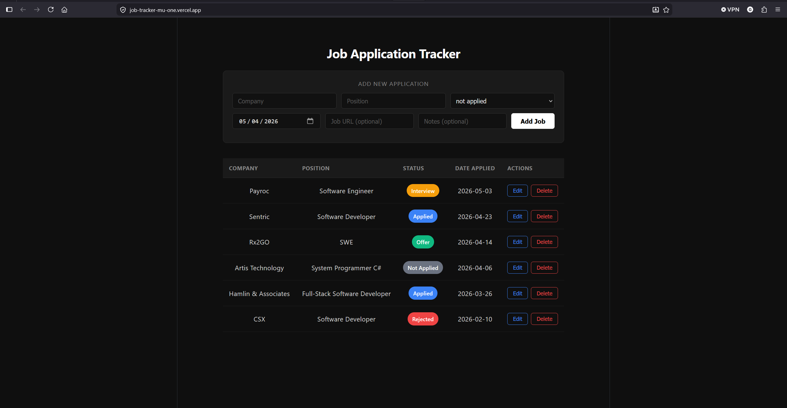

# Job Application Tracker




A full-stack web application to track job applications during a job search. Built with Django REST Framework and React + TypeScript.

## Live Demo 

- Live Demo: https://job-tracker-mu-one.vercel.app
- API: https://job-tracker-production-6e05.up.railway.app/api/jobs/

## Features

- Add, edit, and delete job applications
- Track status: Applied, Not Applied, Interview, Offer, Rejected
- Color-coded status badges
- Expandable rows showing job URL and notes
- URL validation on form submission
- Responsive dark mode UI

## Tech Stack

**Backend**
- Python 3.14
- Django 6.0
- Django REST Framework
- PostgreSQL
- Deployed on Railway

**Frontend**
- React 18
- TypeScript
- Axios
- Vite
- Deployed on Vercel

## Local Development

### Backend

```bash
# Clone the repo
git clone https://github.com/sergeygolstinin/job-tracker.git
cd job-tracker

# Create virtual environment
python -m venv venv
venv\Scripts\activate  # Windows
source venv/bin/activate  # Mac/Linux

# Install dependencies
pip install -r requirements.txt

# Run migrations
python manage.py migrate

# Start server
python manage.py runserver
```

### Frontend

```bash
cd frontend
npm install
npm run dev
```

## API Endpoints

| Method | Endpoint | Description |
|--------|----------|-------------|
| GET | /api/jobs/ | List all applications |
| POST | /api/jobs/ | Create new application |
| PATCH | /api/jobs/{id}/ | Update application |
| DELETE | /api/jobs/{id}/ | Delete application |

## What I Learned Building This

- **Production deployment is harder than localhost.** Wiring up environment variables, CORS, static files, and database migrations on Railway and Vercel taught me more about deployment than any tutorial.
- **REST API design.** Modeling the JobApplication resource, picking the right HTTP verbs, and handling validation on both backend and frontend.
- **Type safety with TypeScript.** Catching bugs at compile time that I would have missed in plain JavaScript.
- **Clean Git history matters.** Writing meaningful commit messages and structuring the repo so a stranger can understand it in 5 minutes.

